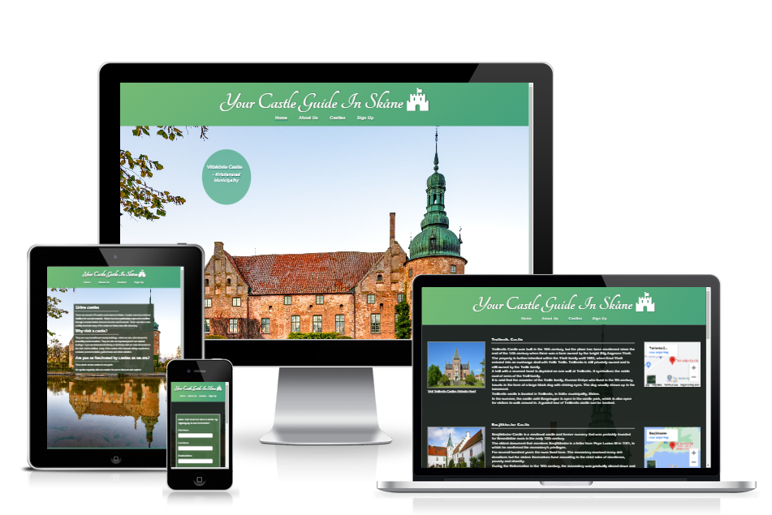

# Castle Guide Skåne

Castle guide Skåne is a site for people who are interested in swedish castles and history in the south part of Sweden. 
The site is intended to target people who wants to visit and learn more about castles. It highlights certain castles around Skåne, and will be useful for people who looking for easy and quick information about wich castles could be worth visiting and where they are located.    

### [View the live website here](https://moolleer.github.io/castle-guide/)

## Features 

### Existing Features

### Future Features

## Testing

### Manual testing

- Text and email inputs in the sign up form are validated.
- All of the websites pages are fully responsive. This was tested by using Google Chrome        
Developers tool.

BROWSERS

### Lighthouse

All of the website pages have been tested using Lighthouse Chrome Developer Tool.
Lighthouse score on castle page can be improved on future updates. The lower score is negatively effected by the images width and height values that differ from the source images dimension.

 - Home page

 - About page

 - Castle page

 
 - Signup form

 
 
### External Links

### Code Validation
##### W3C HTML Validation

- Home page

- About page

- Castles page

- Sign up page

All html pages are validated with [W3C HTML validator](https://validator.w3.org/) and come back with no errors or warnings.

##### W3C CSS Validation

- W3C CSS Validator

CSS validated by [CSS validator](https://jigsaw.w3.org/css-validator/) and no error found.

### Unfixed bugs

## Deployment

The project has been deployed to GitHub pages taking the following steps:

1) In the Github project repository, click on _Settings_.
2) From the Settings menu, locate _Pages_.
3) Under Branch, select _Main_ branch.
4) Click _Save_, and the page will then automatically refresh with a link to the deployed site.

The live link: https://moolleer.github.io/castle-guide/

## Credits

### Content

### Media   

