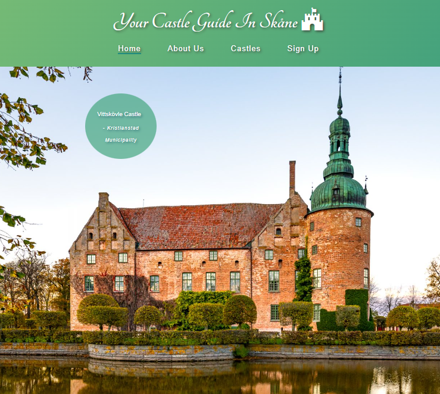
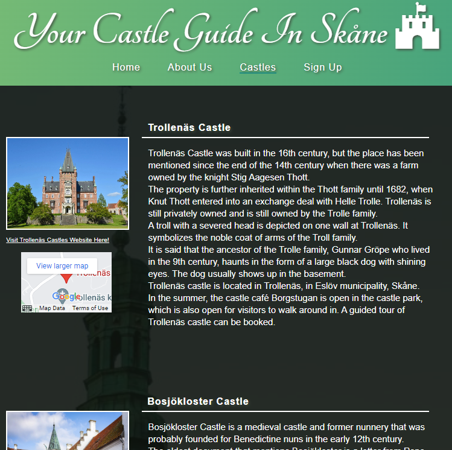

# Castle Guide Skåne

Castle guide Skåne is a site for people who are interested in swedish castles and history in the south part of Sweden. 
The site is intended to target people who wants to visit and learn more about castles. It highlights certain castles around Skåne, and will be useful for people who looking for easy and quick information about wich castles could be worth visiting and where they are located.    

### [View the live website here](https://moolleer.github.io/castle-guide/)

## Features 

### Design

- The color palette for the website was generated from [My Color](https://mycolor.space/). 

- I have used the colors #75BA75 and #1E8F83 for the background.
- I wanted a smooth gradient effect for the page, and found how to implement it here [Gradient reference](https://www.w3schools.com/css/css3_gradients.asp)
- A white text color is used to give a nice contrast against the green background. 
- I wanted to have an opaque background behind the text, so the background image could still be used with white text.

### Existing Features

Home page
- In the homepage, when first loaded the user welcomes with a zoom out effect on the background image of a castle. 
- The name and location is also stated in a small colored circle to catch the users attention.

Header
- A header section with the logo and icon. 
- Navigation links for each page _Home_ (index.html), _About_ (about.html), _Castles_ (castles.html) and _Sign up_ (sign-up.html).
- A colored border effect for letting the user know wich page its currently on.
- The navigation links also have a colored increased padding when hovered over. 

About Us
- The about section give the user some short info. 

- Castles

The castle page contains:

- An image to give the user a perception about the castle looks.
- A clickable map wich opens up in a new tap to give the user a quick perception of the castles location.
- A short describing text about the castle and its history. 
- A link to the castles website.

Responsive design

- How the castle page looks on devices over 1200px 

- How the castle page looks on devices over 992px 

- How the castle page looks on devices over 768px

- How the castle page looks on devices over 600px

- How the castle page looks on devices over 300px

- How the castle page looks on devices under 300px

Sign up
- The page contains a form for the user to fill in if they want to have a newsletter for castles updates.

- The fields requires input and the email field must have a emailaddress.

- The button changes color and to uppercase letters when hovered over.

Footer 

- The icons for the social media links and logo have been taken from [FontAwesome](https://fontawesome.com/)

### Future Features

## Testing

### Manual testing

- Text and email inputs in the sign up form are validated.
- All of the websites pages are fully responsive. This was tested by using Google Chrome        
Developers tool.

BROWSERS

### Lighthouse

All of the website pages have been tested using Lighthouse Chrome Developer Tool.
Lighthouse score on castle page can be improved on future updates. The lower score is negatively effected by the images width and height values that differ from the source images dimension.

 - Home page

 - About page

 - Castle page

 
 - Signup form

 
 
### External Links
All external links have been tested and opens in a seperate tab when clicked: 
- Links to social media in the footer
- Links to the castles homepages
- Links to Google Maps location

### Code Validation
##### W3C HTML Validation

- Home page

- About page

- Castles page

- Sign up page

All html pages are validated with [W3C HTML validator](https://validator.w3.org/) and come back with no errors or warnings.

##### W3C CSS Validation

- W3C CSS Validator

CSS validated by [CSS validator](https://jigsaw.w3.org/css-validator/) and no error found.

### Unfixed bugs

## Deployment

The project has been deployed to GitHub pages taking the following steps:

1) In the Github project repository, click on _Settings_.
2) From the Settings menu, locate _Pages_.
3) Under Branch, select _Main_ branch.
4) Click _Save_, and the page will then automatically refresh with a link to the deployed site.

The live link: https://moolleer.github.io/castle-guide/

## Credits

### Content
- Inspiration from the Love Running projects zoom effect for home page and active class for the navigation links.
- Most of the text and inspiration about the castles are based on information from [Swedish nomad](https://www.swedishnomad.com/sv/skanska-slott/) and [Slottsguiden](https://slottsguiden.info/)

### Media   
The images for the castle and background are from following websites: 
 - [Kulturbilder](https://kulturbilder.wordpress.com/2017/09/27/trollenas-slott-eslov/)
 - [Gylleboannika](https://gylleboannika.se/tag/hovdala-slott/)
 - [Skurup](https://www.skurup.se/svaneholm)
 - [Swedish nomad](https://www.swedishnomad.com/sv/skanska-slott/)
 - [Slottsguiden](https://slottsguiden.info/)

